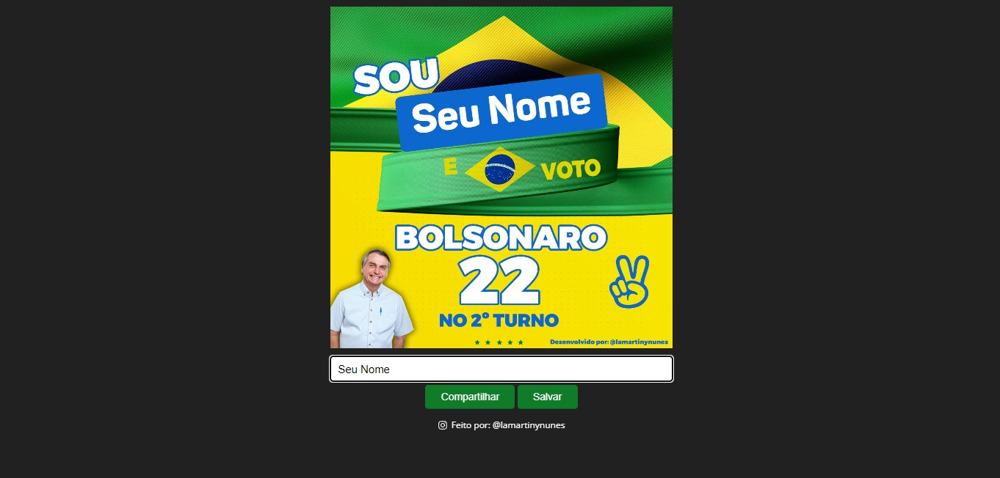

<h1 align="center"> Bolsonaro 2º Turno </h1>

Gere seu flyer personalizado com seu nome de apoio ao Jair Bolsonaro para o segundo turno das eleições brasileira de 2022.
 &#127463;&#127479;

  <a href="#-tecnologias">Tecnologias</a>&nbsp;&nbsp;&nbsp;|&nbsp;&nbsp;&nbsp;
  <a href="#-projeto">Projeto</a>&nbsp;&nbsp;&nbsp;|&nbsp;&nbsp;&nbsp;
  <a href="#memo-licença">Licença</a>

  

 

  

## 🚀 Tecnologias

Esse projeto foi desenvolvido com as seguintes tecnologias:

- HTML e CSS
- JavaScript
- Git e Github

## 💻 Projeto

Projeto Feito para Gerar seu flyer personalizado com seu nome de apoio ao Jair Bolsonaro para o segundo turno das eleições brasileira.

## :memo: Licença

Esse projeto está sob a licença MIT.

---

Feito com ♥ by Lamartiny Nunes : [Instagran](https://www.instagram.com/lamartinynunes/) :  [Linkedin](https://www.linkedin.com/in/lamartiny-nunes/)
